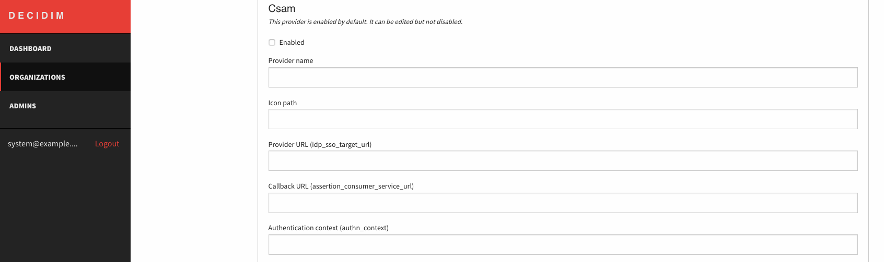

# Decidim::Verifications::Omniauth

## About

This is an extension of Decidim. Its main purpose is to add two new options for the verifications workflow:
* [CSAM](https://www.csam.be/en/index.html) which is the official Identity Providers (IDP) from the Belgian Government.
* SAML: for generic integration with external Identity Providers (IDP)

[Learn more about CSAM](https://www.csam.be/en/index.html).

## How to install

Add this line to your application's Gemfile:

```ruby
gem 'decidim-verifications_omniauth', git: 'git@github.com:belighted/decidim-module-verifications_omniauth.git'
```

And then execute:

```bash
$ bundle install
$ bundle exec rails decidim_verifications_omniauth:install:migrations
$ bundle exec rails db:migrate
```

Add setup for new verifications workflow in the initializer e.g `{APP}/config/initializers/decidim.rb`

_For SAML_
```ruby
require 'decidim/verifications/omniauth/bosa_action_authorizer'

Decidim::Verifications.register_workflow(:saml) do |workflow|
  workflow.engine = Decidim::Verifications::Omniauth::Engine
  workflow.admin_engine = Decidim::Verifications::Omniauth::AdminEngine
  workflow.action_authorizer = "Decidim::Verifications::Omniauth::BosaActionAuthorizer"
  workflow.omniauth_provider = :saml
  workflow.minimum_age = 16
end
```

_For CSAM_
```
Decidim::Verifications.register_workflow(:csam) do |workflow|
  workflow.engine = Decidim::Verifications::Omniauth::Engine
  workflow.admin_engine = Decidim::Verifications::Omniauth::AdminEngine
  workflow.action_authorizer = "Decidim::Verifications::Omniauth::BosaActionAuthorizer"
  workflow.omniauth_provider = :csam
  workflow.minimum_age = 16
end
```
You can specify the form you want to use (optionnaly) by adding the next line to your configuration:
`workflow.form = "Decidim::Verifications::Omniauth::OmniauthAuthorizationForm"`


Add a translations keys for new omniauth_providers for all supported locales in the `{APP}/config/locales`.
Example for `{APP}/config/locales/en.yml`:

```yaml
en:
  decidim:
    authorization_handlers:
      csam:
        name: CSAM
        explanation: Validate with your CSAM account
      saml:
        name: CSAM eID
        explanation: Validate with your CSAM eID account
      admin:
        csam:
          help:
            - Validate with a CSAM account
        saml:
          help:
            - Validate with a CSAM eID account
```

You can also specify the default value fo parameters in your Decidim app for the bootstrap.
Once saved, only the values present in the database will be used.
In the application's `config/secrets.yml` add following options in the omniauth section:

```yaml
  omniauth:
    saml:
      enabled: true
    csam:
      enabled: true
      provider_name:                  [name of the application on IDP side]
      icon_path:                      "eid-logo.svg"
      idp_sso_target_url:             [URL oof IDP for sign-in]
      assertion_consumer_service_url: "https:/[your domain]/users/auth/csam/callback"
      authn_context:                  [level of authentication, e.g. "urn:be:fedict:iam:fas:enterprise:Level300"]
      issuer:                         "https://[your domain]/users/auth/csam/metadata"
      protocol_binding:               "urn:oasis:names:tc:SAML:2.0:bindings:HTTP-Redirect"
      idp_slo_target_url:             "https://[your domain]/users/auth/csam/spslo"
      idp_cert: ""
      idp_key: ""
```

You will need also to generate a private key together with a certificate that will be used for CSAM.
For SAML, depending on the configuration of the IDP, you might required a certificate too.
You can find plenty of documentation on Internet on how to generate them. However, here is a shortcut using `openssl`.

```
openssl req -x509 -newkey rsa:4096 -sha256 -days 3650 -nodes \
  -keyout monopinion.key -out monopinion.crt -extensions san -config \
  <(echo "[req]";
    echo distinguished_name=req;
    echo "[san]";
    echo subjectAltName=DNS:[your_domain]
    ) \
  -subj "/CN=[your domain]"
```

## Belgium: CSAM and Person Services

If you have access to the API of person services, you can enrich the configuration of CSAM with them.
It will allow the application to fetch some personal data about the user to allow a better characterization of the person.
It can be useful to have for instance, region/city-based features.

## Usage

As a system admin you can enable a new authorization strategies for organization in the following steps:

* sign in to the `/system`

* Go to organization `Edit` view

* Scroll down to the `Omniauth settings` section and enable strategy

* Set configuration option for the enabled strategy


For each organization you have to set valid configuration options:

* SAML


* CSAM



## Testing

Create a dummy app in the `spec` dir:

```bash
$ DATABASE_USERNAME=<username> DATABASE_PASSWORD=<password>  bundle exec rails decidim:generate_external_test_app
$ cd spec/decidim_dummy_app
$ bundle exec rails decidim_verifications_omniauth:install:migrations
$ RAILS_ENV=test bundle exec rails db:migrate
```

Apply changes to decidim_dummy_app and provide configuration mentioned in [How to](#how-to-install) section.

Run tests:

```bash
bundle exec rspec spec
```

### Test code coverage

If you want to generate the code coverage report for the tests, you can use the SIMPLECOV=1
environment variable in the rspec command as follows:

```bash
$ SIMPLECOV=1 bundle exec rspec
```

This will generate a folder named coverage in the project root which contains the code coverage report.

## Contributing

For instructions how to setup your development environment for Decidim, see [Decidim](https://github.com/decidim/decidim).
Also follow Decidim's general instructions for development for this project as well.

### Developing

To start contributing to this project, first:

    Install the basic dependencies (such as Ruby and PostgreSQL)
    Clone this repository

Decidim's main repository also provides a Docker configuration file if you prefer to use Docker instead of installing the dependencies locally on your machine.

You can create the development app by running the following commands after cloning this project:

```bash
$ bundle
$ DATABASE_USERNAME=<username> DATABASE_PASSWORD=<password> bundle exec be rails decidim:generate_external_development_app
```

Note that the database user has to have rights to create and drop a database in order to create the dummy test app database.

Then to test how the module works in Decidim, start the development server:

```bash
$ cd development_app
$ bundle exec rails decidim_verifications_omniauth:install:migrations
$ DATABASE_USERNAME=<username> DATABASE_PASSWORD=<password> bundle exec rails db:migrate
$ DATABASE_USERNAME=<username> DATABASE_PASSWORD=<password> bundle exec rails s
```

In case you are using rbenv and have the rbenv-vars plugin installed for it,
you can add the environment variables to the root directory of the project in a file named .rbenv-vars.
If these are defined for the environment, you can omit defining these in the commands shown above.

Core utils were extracted from the [OpenSourcePolitics/decidim](https://github.com/OpenSourcePolitics/decidim/tree/alt/petition_merge)
as an extension, to provide functionality without forking the decidim.

## License

This engine is distributed under the [GNU AFFERO GENERAL PUBLIC LICENSEa](LICENSE-AGPLv3.txt).
